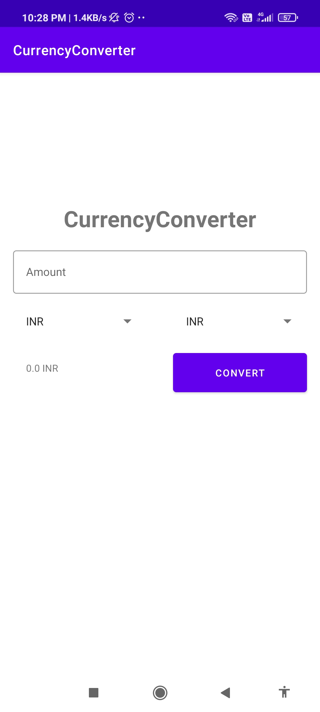

# CurrencyConverter
A  Currency Converter  Application for implementing  below items in Android.
* 100% [Kotlin](https://kotlinlang.org/)
* MVVM Design Pattern 
* [Material Design Components](https://material.io/)
* Dependency Injection Using [Kodein](https://kodein.org/di/)
* Network Operations Using [Retrofit](https://square.github.io/retrofit/)
* Currency Conversion Using Public API [ExchangeRateApi](https://exchangeratesapi.io/)
* Multi Threading Using [Kotlin Coroutines](https://kotlinlang.org/docs/coroutines-overview.html)
* ViewBinding to Access layout Views 

[](https://opensource.org/licenses/Apache-2.0)


# Architecture
This App Uses MVVM(Model ViewViewModel) Architeture
   

   
# Application Structure

   com.knowtech.currencyconverter    # Root Package
   
    ├── core                # Core Layer
    │   ├── network      
    │   └── factory         # ViewModel Factory
     |
    ├── di                  # Dependency Injection             
     |
    ├── ui                  # View layer
    │   ├── state           # UI States
    │   ├── viewmodel       # ViewModel
    │   └── activity        # Activity    
     |
    └── data               # Data Layer
        ├── models         # ViewModels
        ├── repositories   # Repository
        └── retrofit       # Network Operations
            
## 📸 Screenshots  
|||
|:--------:| -------------:|
| | |
|  | |


# License
```xml
    Copyright 2021 Aditya Gupta (mailadityaguptaa@gmail.com)
    
    Licensed under the Apache License, Version 2.0 (the "License");
    you may not use this file except in compliance with the License.
    You may obtain a copy of the License at
    
    http://www.apache.org/licenses/LICENSE-2.0
    
     Unless required by applicable law or agreed to in writing, software
     distributed under the License is distributed on an "AS IS" BASIS,
     WITHOUT WARRANTIES OR CONDITIONS OF ANY KIND, either express or implied.
     See the License for the specific language governing permissions and
    limitations under the License.
```